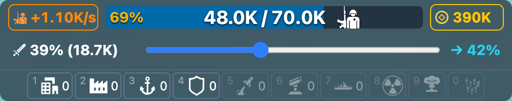
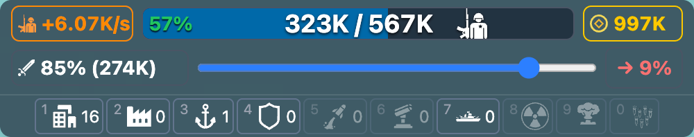

# OpenFront.io - Control Panel Enhancement (Userscript)

Adds troop percentage indicators to OpenFront.io’s control panel:

- **Current troops %** (colored by thresholds)
- **Remaining troops %** after applying the attack ratio (also shows remaining troops count)

## Screenshots

## Thresholds & colors

The script colors troop percentages using these thresholds. Colors are meant to indicate your troop growth speed at that % (income rate): very low/high % grows slower; mid-range grows fastest.

### Current troops % (and Remaining % base color)

|            Range | Color                                                                         |
| ---------------: | :---------------------------------------------------------------------------- |
|    < 9% or > 82% |    |
|  9–17% or 71–82% |      |
| 18–22% or 65–70% |      |
| 23–30% or 55–64% |            |
|           31–54% |  |

### Remaining troops % special handling

Remaining % uses the same coloring as above **except**:

- **If remaining % > 55%**, it is forced to .

## Install

### From Greasy Fork (recommended)

Install from Greasy Fork and keep auto-updates enabled.

### Manual install (developer)

1. Install a userscript manager:
   - Tampermonkey (Chrome/Edge) or Violentmonkey (Firefox)
2. Open this file and click **Install**:
   - `openfront-control-panel-enhancement.user.js`

## Supported sites

- `https://*.openfront.io/*`
- `https://*.openfront.dev/*`

## License

MIT
